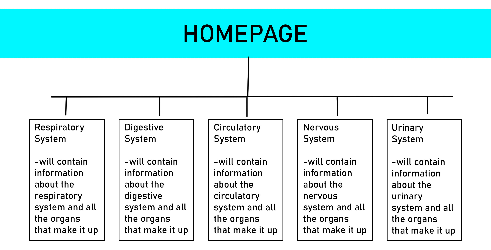
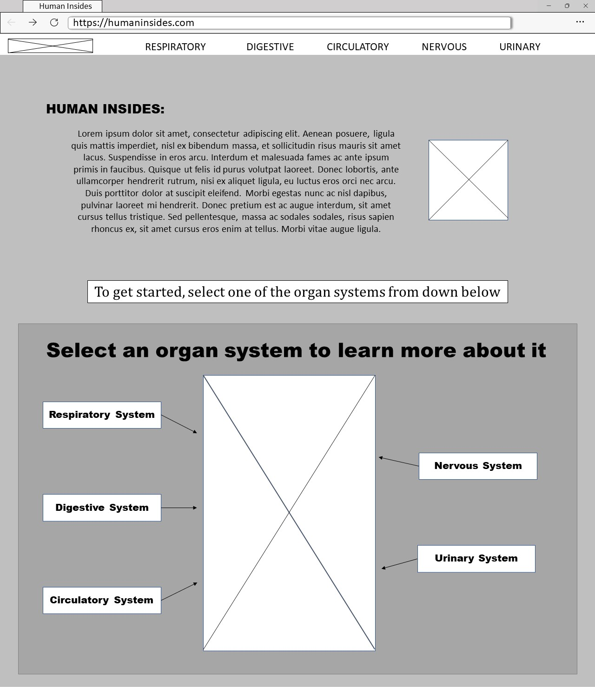
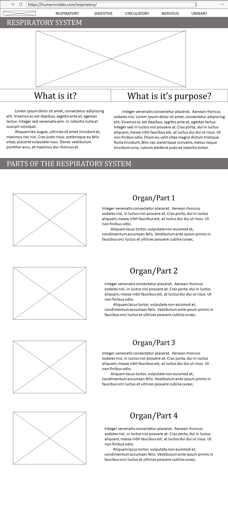

# Magnesium_MorescaSanchez

### Human Insides
**Description**: Our educational website will talk about the different parts and systems of the human body in a fun and comprehensive way.
We will try to explain how the different organ systems work and what their function is in our body, and further listing and explaining the individual organs in these systems.
### OUTLINE

### WIREFRAME
**Homepage Wireframe:**    

**Content/Information Pages Wireframe:**    

